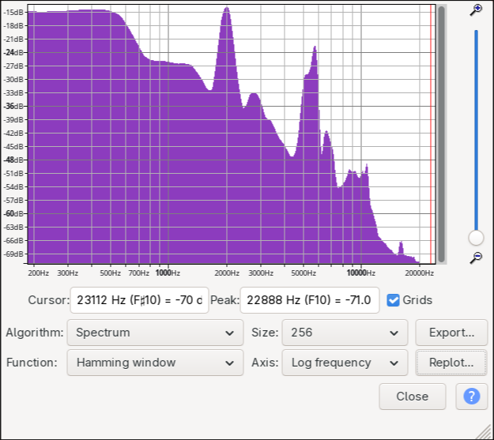
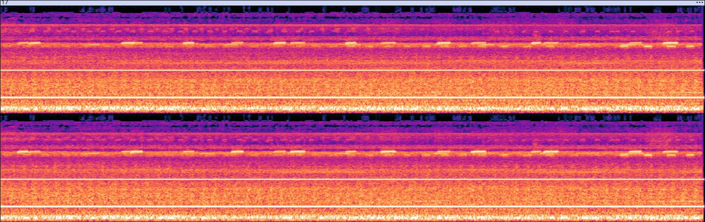
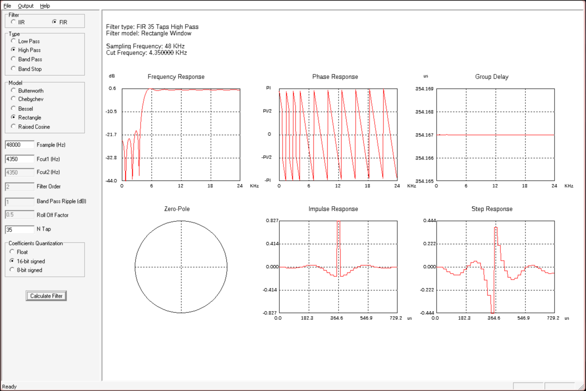
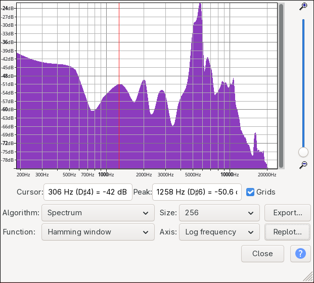
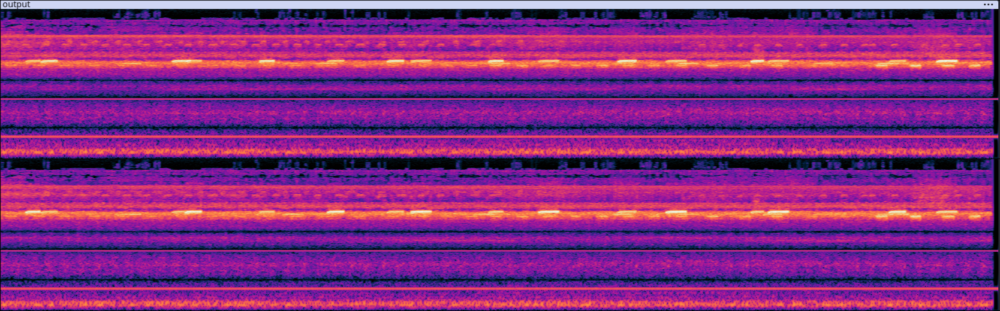
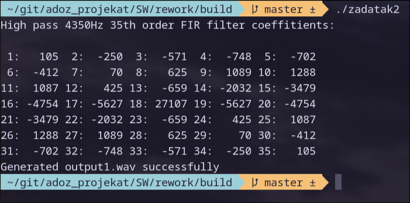
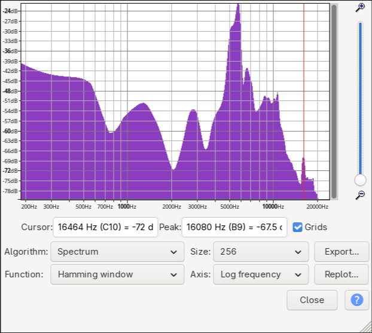
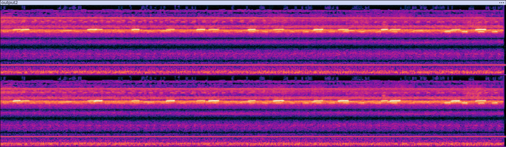
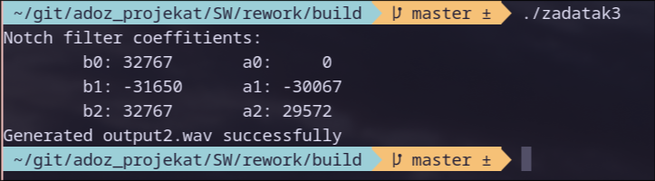

# ADOZ Projekat 2025/26

## Zadatak 1

U okviru ovog zadatka uradjena je spektralna analiza ulaznog signala, koji je u mom slucaju bio sastavljen od pozadinskog zvuka lokomotive, zrikavaca i sinusa na frekvencijama od 500Hz i 2000Hz.




Za mene koristan realan zvuk od ova dva su zrikavci, koji se nalaze na frekventnom rasponu od 4350Hz do oko 7500Hz. Na ovom rasponu se ne nalazi nijedan od dva sinusa, ali kako ce u narednim zadacima biti primeceno, sinus od 2000Hz se i dalje dosta jako cuje i nakon provlacenja kroz visokopropustni filtar od 4350Hz, s toga to je frekvencija sinusa koju cu uklanjati notch filterom.

## Zadatak 2

Uz pomoc WinFilter-a generisemo visokopropustni FIR filter 35-og reda za frekvencije iznad 4350Hz. To izgleda ovako:



Provlacenjem ulaznog signala kroz ovaj filter koriscenjem ``fir_circular()`` funkcije sa vezbi, dobija se izlazni signal ``Output1.wav`` koji izgleda ovako:




Kao sto moze da se primeti, filter je dosta oslabio signale na frekvencijama manjim od 4350Hz, i na spektrogramu mozemo primetiti da se sinusi jos uvek mogu primetiti. Pokretanjem ``SW/rework/build/zadatak2`` programa u terminalu se ispisuju koeficijenti filtera, i generise se signal sa slike.



## Zadatak 3

Kako je sinus na 2000Hz mnogo cujniji od onog na 500Hz, na njega cemo primeniti notch filter. Koeficijente notch filtera generisemo uz pomoc ``generate_notch_coeffs()`` funkcije koja izgleda ovako:

```
void generate_notch_coeffs(float sample_rate, float notch, float width, int16_t* b_coeffs, int16_t* a_coeffs) {      // keep width between 0.9 and 1.0
    float f0 = notch / sample_rate;     // normalized notch frequency
    
    float b0 = 1.0f;
    float b1 = -2.0f * cos(2.0f * M_PI * f0);
    float b2 = 1.0f;
    float a1 = -2.0f * width * cos(2.0f * M_PI * f0);
    float a2 = width * width;

    b_coeffs[0] = (int16_t)(b0 * Q15_SCALE);
    b_coeffs[1] = (int16_t)(b1 * Q15_SCALE / 2);
    b_coeffs[2] = (int16_t)(b2 * Q15_SCALE);
    a_coeffs[0] = 0;
    a_coeffs[1] = (int16_t)(a1 * Q15_SCALE / 2);
    a_coeffs[2] = (int16_t)(a2 * Q15_SCALE);
}
```

Na ovaj nacin mozemo generisati bilo koji notch filter implementiran kao IIR filter drugog reda, sa bilo kojom sirinom. Provlacenjem prethodno isfiltriranog signala kroz ovaj IIR filter uz pomoc ``iir_basic()`` funkcije sa vezbi dobija se sledeci signal:




Pokretanjem ``SW/rework/build/zadatak3`` programa u terminalu se ispisuju koeficijenti IIR filtera izracunati funkcijom ``generate_notch_coeffs()``, i generise se ``Output2.wav`` ciji se graf i spektrogram vide na slikama iznad.


